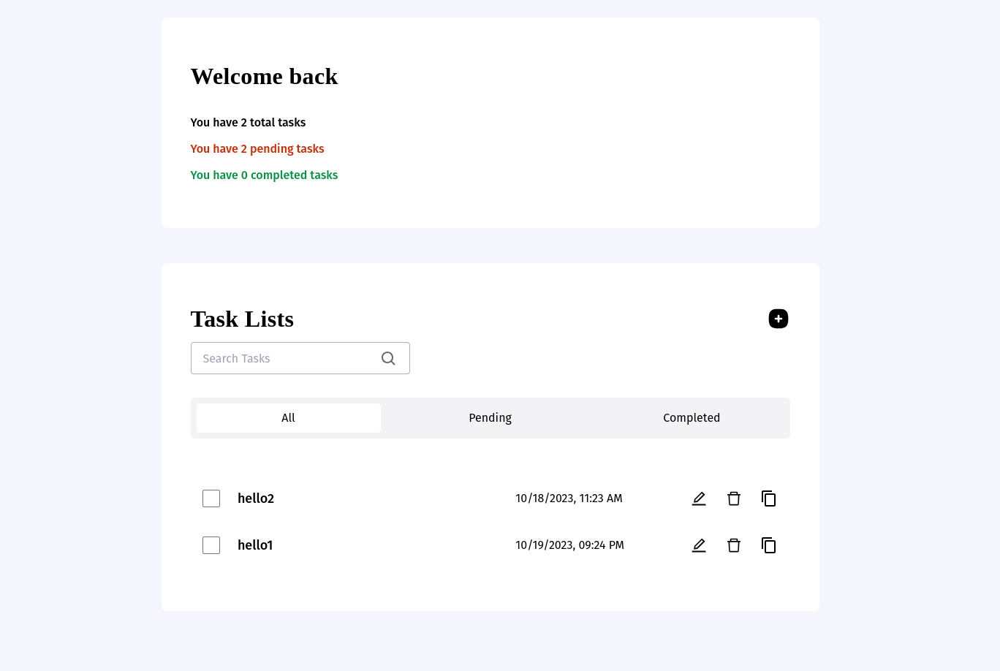

# Advanced Todo App

The **Advanced Todo App** is a powerful task management application built with Vite, React, and TypeScript. It provides a variety of features to help you efficiently manage your tasks.

## Features

- **Task Creation:** Create new tasks with ease.
- **Edit and Update:** Modify task details as needed.
- **Search Tasks:** Quickly find specific tasks with a search feature.
- **Mark as Completed:** Differentiate between pending and completed tasks.
- **Data Persistence:** Your task list is saved and persists even after a page refresh.
- **Copy to Clipboard:** Copy task details to your clipboard for easy sharing.

  
## Screenshots

<div style="text-align:center; display:flex;">
  
  
</div>

## Live URL

You can try out the Advanced Todo App by visiting the live site:

[Live Site](https://advanced-todo-app-ten.vercel.app/)

## Installation

To install and run the Advanced Todo App on your local machine, follow these steps:

1. Make sure you have [Node.js](https://nodejs.org/) installed on your system.

2. Clone this repository to your local machine:

   ```bash
   git clone git@github.com:Simplyauf/Advanced-Todo-App.git

3. Navigate to the project directory:
   
   ```bash
   cd advanced-todo-app
4. Install project dependencies using Yarn  or npm:
   
     ```bash
   yarn install  or   npm install

## Usage

Once you've installed the required dependencies, you can start the development server:

     yarn dev or npm run dev

### This template provides a minimal setup to get React working in Vite with HMR and some ESLint rules.

Currently, two official plugins are available:

- [@vitejs/plugin-react](https://github.com/vitejs/vite-plugin-react/blob/main/packages/plugin-react/README.md) uses [Babel](https://babeljs.io/) for Fast Refresh
- [@vitejs/plugin-react-swc](https://github.com/vitejs/vite-plugin-react-swc) uses [SWC](https://swc.rs/) for Fast Refresh

## Expanding the ESLint configuration

If you are developing a production application, we recommend updating the configuration to enable type aware lint rules:

- Configure the top-level `parserOptions` property like this:

```js
   parserOptions: {
    ecmaVersion: 'latest',
    sourceType: 'module',
    project: ['./tsconfig.json', './tsconfig.node.json'],
    tsconfigRootDir: __dirname,
   },
```

- Replace `plugin:@typescript-eslint/recommended` to `plugin:@typescript-eslint/recommended-type-checked` or `plugin:@typescript-eslint/strict-type-checked`
- Optionally add `plugin:@typescript-eslint/stylistic-type-checked`
- Install [eslint-plugin-react](https://github.com/jsx-eslint/eslint-plugin-react) and add `plugin:react/recommended` & `plugin:react/jsx-runtime` to the `extends` list
